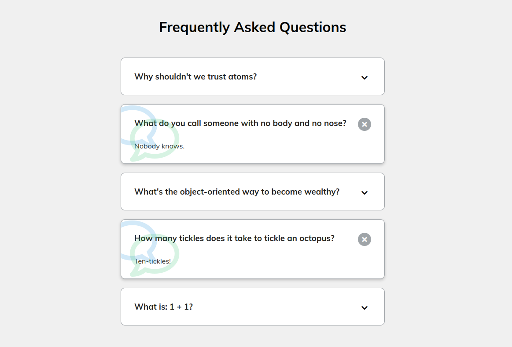

# FAQ Cards/Tabs

- Fontawesome Icons with specific unicodes

- Expandable/collapsible FAQ-cards/tabs with JS (toggling the active class on the parentnode)

```
const toggles = document.querySelectorAll(".faq-toggle");

toggles.forEach((toggle) => {
  toggle.addEventListener("click", () => {
    toggle.parentNode.classList.toggle("active");
  });
});

```


